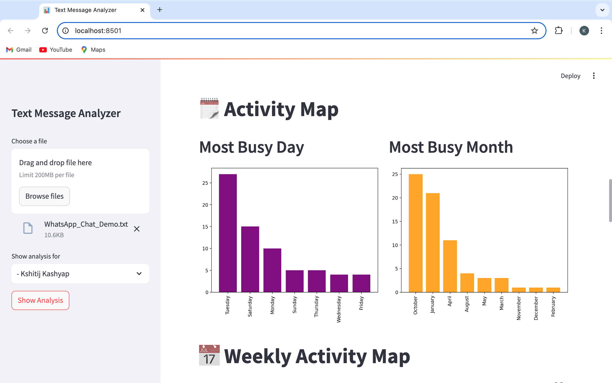

# Text Message Analyzer 📊

**Text Message Analyzer** is an interactive data analysis tool built using Python and Streamlit that allows users to analyze text message data. The application performs multiple analyses like message statistics, word clouds, activity maps, emoji analysis, and more, providing a comprehensive breakdown of message data in an easy-to-use format.

## Features ✨

- **Top Statistics**: Displays total messages, words, media, and links shared.
- **Monthly & Daily Timeline**: Provides a graphical representation of the activity timeline.
- **Activity Map**: Shows the busiest days and months.
- **Weekly Activity Heatmap**: Analyzes activity patterns on a weekly scale.
- **Word Cloud**: Visualizes the most common words used in messages.
- **Emoji Analysis**: Breaks down emoji usage and displays a pie chart of emoji frequencies.
- **Busiest Users**: Identifies the most active users in a group chat.

## Prerequisites 🚀

Ensure you have the following installed:

- Python 3.7+
- `pip` package manager


## Installation 📦

Follow the steps below to set up the project locally:

1. Clone the repository:
```
git clone https://github.com/kshitij7704/text-message-analyzer.git
cd text-message-analyzer
```

2. Create a virtual environment:
  ```
  python -m venv env
  source env/bin/activate  # For MacOS/Linux
  env\Scripts\activate  # For Windows
  ```
3. Install the required dependencies:
```
pip install -r requirements.txt
```

## Usage 💻
1. Run the Streamlit app:
```
streamlit run app.py
```
2. Once the app is running, open a browser and go to:
```
http://localhost:8501
```
3. Upload your chat file (in .txt format) to start the analysis.


## Project Structure 📂
```
text-message-analyzer/
│
├── app.py                # Streamlit application file
├── preprocess.py         # Data preprocessing functions
├── helper.py             # Helper functions for data analysis
├── requirements.txt      # List of dependencies
├── stop_hinglish.txt     # Stop words file
└── README.md             # Project documentation
```

## Screenshots 📸
Below are some screenshots of the application in action:
- Main Dashboard showing Top Statistics and Timeline


- Activity Map displaying most busy days and months


## Contributing 🤝
We welcome contributions to this project! If you want to contribute, please follow these steps:
1. Fork the repository.
2. Create a new branch (git checkout -b feature/your-feature).
3. Make your changes and commit them (git commit -am 'Add new feature').
4. Push to the branch (git push origin feature/your-feature).
5. Create a new Pull Request.
